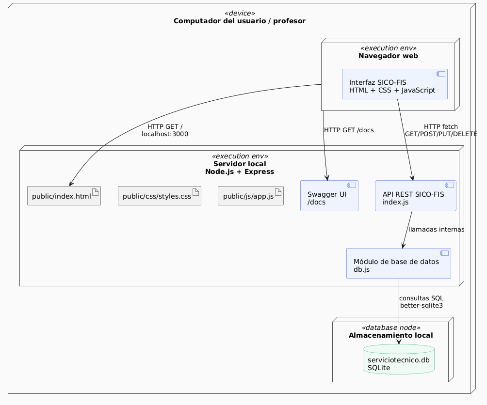
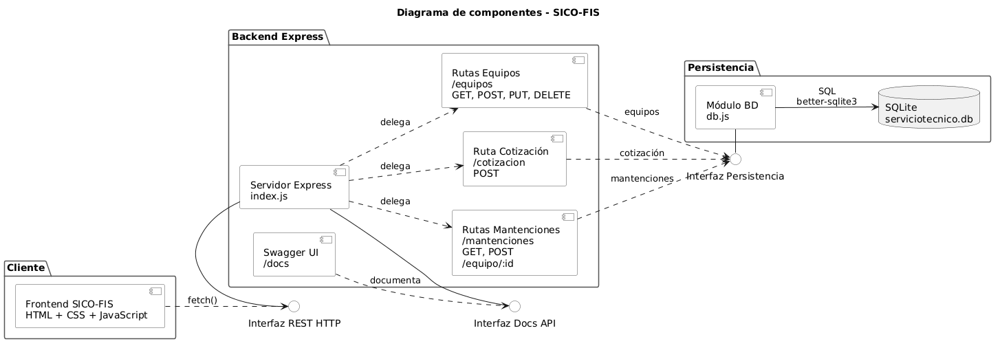

# Arquitectura del Sistema

## Proyecto

**SICO-FIS – Sistema de Gestión de Equipos y Servicios Técnicos para Panadería**

---

## Estilo arquitectónico

El sistema SICO-FIS utiliza un estilo arquitectónico **cliente-servidor**, organizado mediante una **API REST** y una separación simple por capas.

La aplicación se compone de:

* Un **frontend web** desarrollado con HTML, CSS y JavaScript.
* Un **backend** desarrollado con Node.js y Express.
* Una **base de datos local SQLite** administrada desde `db.js`.
* Una **documentación de API** disponible mediante Swagger en `/docs`.

Este estilo permite separar la interfaz de usuario, la lógica del servidor y la persistencia de datos, facilitando la mantención del sistema y la comprensión de sus responsabilidades principales.

---

## Justificación del estilo arquitectónico

Se selecciona este estilo porque se ajusta al alcance actual del proyecto y a las funcionalidades implementadas en la Entrega 3.

El sistema necesita permitir que una encargada de producción consulte equipos industriales, revise su disponibilidad, genere cotizaciones y consulte mantenciones desde una interfaz web. Para ello, la separación entre frontend, API REST y base de datos permite organizar el flujo de información de forma clara.

| ID      | Atributo de calidad      | Descripción                                                                         | Justificación arquitectónica                                                                                                                                              |
| ------- | ------------------------ | ----------------------------------------------------------------------------------- | ------------------------------------------------------------------------------------------------------------------------------------------------------------------------- |
| SICO-01 | Eficiencia / Rendimiento | El sistema debe procesar solicitudes en un tiempo adecuado para el usuario.         | El uso de una API REST local con Express y SQLite permite responder rápidamente a operaciones simples como listar equipos, consultar mantenciones y generar cotizaciones. |
| SICO-03 | Disponibilidad           | El sistema debe estar disponible durante la ejecución local de la aplicación.       | Al ejecutarse localmente con `npm start`, el frontend, backend y base de datos pueden operar en el mismo entorno sin depender de servicios externos.                      |
| SICO-09 | Recuperabilidad          | El sistema debe mantener la información registrada ante reinicios de la aplicación. | La información se almacena en SQLite mediante el archivo `serviciotecnico.db`, lo que permite conservar equipos y mantenciones entre ejecuciones.                         |

---

## Sacrificios del estilo arquitectónico

El principal sacrificio de esta arquitectura es que la implementación actual concentra varias responsabilidades en el archivo `index.js`, incluyendo configuración del servidor, rutas, validaciones, lógica de negocio y documentación Swagger.

Esto permite avanzar rápidamente en una entrega académica, pero puede dificultar la mantención si el sistema crece. Por esta razón, se reconoce como deuda técnica y se propone separar el backend en futuras iteraciones usando carpetas como `routes/`, `controllers/`, `services/` y `repositories/`.

Además, SQLite es adecuado para desarrollo, demostración y prototipos locales, pero no es la mejor opción para un sistema productivo multiusuario. Si SICO-FIS escalara a producción, sería recomendable evaluar una base de datos cliente-servidor como PostgreSQL o MySQL.

---

## Diagrama de arquitectura

La arquitectura del sistema se encuentra representada en los diagramas de despliegue y componentes documentados en `Diagramas.md`.

### Diagrama de despliegue con componentes

### Diagrama de componentes

---

## Componentes principales

### 1. Frontend SICO-FIS

**Ubicación:** `public/index.html`, `public/css/styles.css`, `public/js/app.js`

**Responsabilidad:**
Proveer la interfaz web para que la encargada de producción pueda interactuar con el sistema.

**Funciones principales:**

* Mostrar el tablero general.
* Listar equipos industriales.
* Registrar, editar y eliminar equipos.
* Generar cotizaciones.
* Registrar mantenciones.
* Consultar historial de mantenciones.
* Mostrar mensajes de éxito o error.

**Depende de:**

* API REST expuesta por el backend Express.

---

### 2. Backend Express

**Ubicación:** `index.js`

**Responsabilidad:**
Procesar las solicitudes HTTP recibidas desde el frontend y exponer los endpoints principales del sistema.

**Funciones principales:**

* Configurar el servidor Express.
* Servir los archivos estáticos de `public/`.
* Exponer endpoints para equipos.
* Exponer endpoint para cotización.
* Exponer endpoints para mantenciones.
* Documentar la API mediante Swagger.
* Validar entradas básicas.
* Coordinar la comunicación con `db.js`.

**Depende de:**

* Módulo de base de datos `db.js`.
* Librerías Node.js y Express.

---

### 3. Módulo de base de datos

**Ubicación:** `db.js`

**Responsabilidad:**
Administrar la conexión con SQLite y crear las tablas necesarias para el funcionamiento del sistema.

**Funciones principales:**

* Crear la tabla `equipos`.
* Crear la tabla `mantenciones`.
* Conectar la aplicación con `serviciotecnico.db`.
* Cargar datos iniciales si la base de datos está vacía.

**Depende de:**

* Librería `better-sqlite3`.
* Archivo local `serviciotecnico.db`.

---

### 4. Base de datos SQLite

**Ubicación:** `serviciotecnico.db`

**Responsabilidad:**
Persistir la información utilizada por el sistema.

**Datos almacenados:**

* Equipos industriales.
* Mantenciones asociadas a equipos.

**Observación:**
El archivo `serviciotecnico.db` se genera localmente al ejecutar la aplicación. No es necesario subirlo al repositorio si se encuentra excluido mediante `.gitignore`.

---

### 5. Swagger UI

**Ruta:** `/docs`

**Responsabilidad:**
Permitir la revisión y prueba de los endpoints disponibles en la API.

**Funciones principales:**

* Mostrar endpoints de equipos.
* Mostrar endpoint de cotización.
* Mostrar endpoints de mantenciones.
* Facilitar pruebas manuales desde el navegador.

---

## Relaciones entre componentes

| Origen          | Destino         | Relación                                                          |
| --------------- | --------------- | ----------------------------------------------------------------- |
| Frontend        | Backend Express | Envía solicitudes HTTP mediante `fetch()`.                        |
| Backend Express | Módulo `db.js`  | Solicita consultas y operaciones sobre la base de datos.          |
| Módulo `db.js`  | SQLite          | Ejecuta consultas SQL usando `better-sqlite3`.                    |
| Swagger UI      | Backend Express | Documenta y permite probar los endpoints definidos en `index.js`. |

---

## ASR: Architectural Significant Requirements

### ASR-01: Rendimiento en operaciones principales

El sistema debe responder en un tiempo adecuado a operaciones frecuentes como listar equipos, consultar un equipo, registrar mantenciones y generar cotizaciones.

**Decisión arquitectónica asociada:**
Se utiliza una API REST local con Express y SQLite, lo que permite ejecutar consultas simples de forma rápida en el entorno de demostración.

---

### ASR-02: Persistencia de datos

El sistema debe conservar los equipos y mantenciones registrados entre ejecuciones de la aplicación.

**Decisión arquitectónica asociada:**
Se utiliza SQLite como base de datos local mediante `better-sqlite3`, permitiendo persistir la información en el archivo `serviciotecnico.db`.

---

### ASR-03: Mantenibilidad del sistema

El sistema debe ser comprensible y modificable para futuras iteraciones.

**Decisión arquitectónica asociada:**
Se separa el frontend en HTML, CSS y JavaScript. Además, se documenta como deuda técnica la necesidad de separar el backend en rutas, controladores, servicios y repositorios.

---

## Conclusión

La arquitectura actual de SICO-FIS es adecuada para una entrega académica funcional, ya que permite demostrar una historia de usuario completa con frontend, backend y base de datos. El estilo cliente-servidor con API REST facilita la comunicación entre la interfaz web y el servidor Express, mientras que SQLite permite persistir la información de equipos y mantenciones de forma local.

Como mejora futura, se recomienda modularizar el backend, automatizar pruebas y evaluar una base de datos cliente-servidor si el sistema pasa a un contexto productivo.
