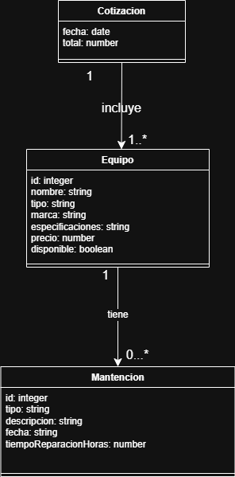
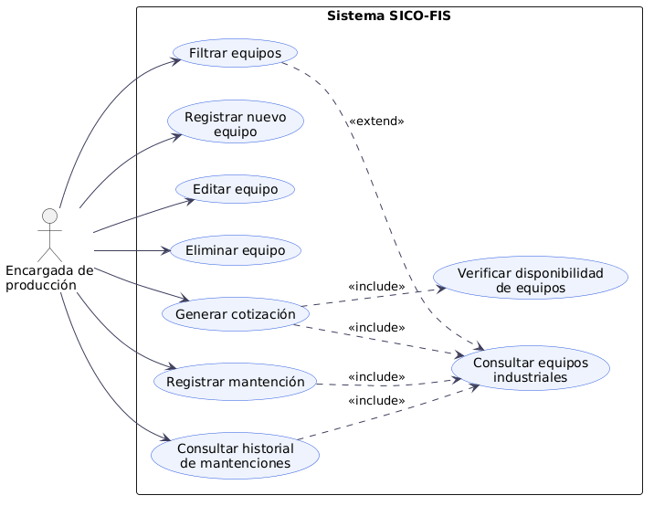
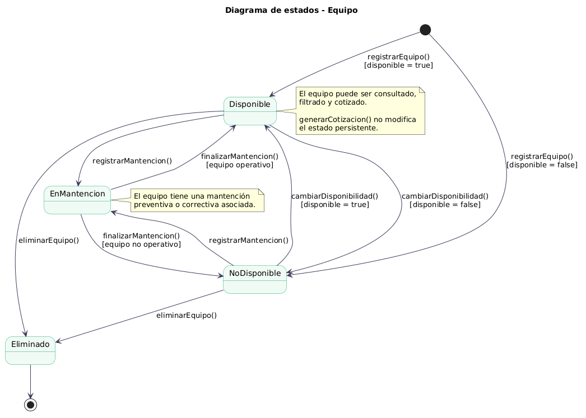
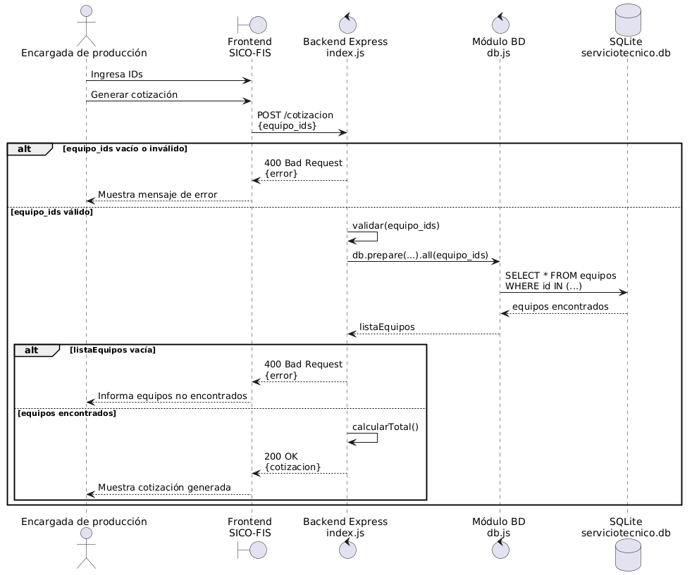

# Diagramas de Análisis y Diseño

## Proyecto

**SICO-FIS – Sistema de Gestión de Equipos y Servicios Técnicos para Panadería**

---
## 1. Modelo de dominio

El modelo de dominio identifica las entidades principales del sistema SICO-FIS, sus atributos y las relaciones entre ellas. En esta entrega, el dominio se centra en la gestión de equipos industriales, sus mantenciones asociadas y la generación de cotizaciones.

El modelo considera que una cotización incluye uno o más equipos, mientras que un equipo puede tener cero o muchas mantenciones registradas. La entidad `Equipo` es el núcleo del sistema, ya que concentra los datos principales utilizados para consulta, disponibilidad, precio, cotización e historial de mantenciones.

## 2. Diagrama de casos de uso

El diagrama de casos de uso representa las funcionalidades observables del sistema SICO-FIS desde la perspectiva de la encargada de producción. Para esta entrega, se consideran las funcionalidades asociadas a la consulta de equipos, generación de cotizaciones, gestión básica de equipos y registro de mantenciones.

Este diagrama evita separar los casos de uso por tipo de maquinaria, ya que horno, refrigerador, freidora u otros equipos corresponden al atributo `tipo` de la entidad `Equipo`, no a casos de uso independientes.

---

## 3. Diagrama de estados del equipo

El diagrama de estados modela el ciclo de vida de la entidad `Equipo`, mostrando los estados estables por los que puede pasar desde su registro hasta su eliminación dentro del sistema.

El equipo puede encontrarse disponible, no disponible, en mantención o eliminado. Las transiciones representan eventos funcionales del sistema, como registrar un equipo, cambiar su disponibilidad, registrar una mantención, finalizar una mantención o eliminar el equipo. La generación de una cotización no modifica el estado persistente del equipo, por lo que se documenta como una acción posible dentro del estado `Disponible`.

---

## 4. Diagrama de despliegue con componentes

El diagrama de despliegue muestra dónde se ejecutan los principales componentes del sistema SICO-FIS. La aplicación se ejecuta localmente en el computador del usuario o profesor mediante Node.js y Express.

El navegador carga la interfaz web desde el servidor local y realiza solicitudes HTTP a la API REST. El backend procesa las operaciones de equipos, cotizaciones y mantenciones mediante `index.js`. El módulo `db.js` administra la conexión con la base de datos SQLite `serviciotecnico.db` usando `better-sqlite3`.

---

## 5. Diagrama de componentes

El diagrama de componentes representa la arquitectura lógica del sistema SICO-FIS, mostrando los módulos principales, sus dependencias y las interfaces utilizadas para comunicarse.

El frontend consume la interfaz REST HTTP mediante `fetch()`. El servidor Express implementado en `index.js` expone las rutas principales del sistema: equipos, cotización y mantenciones. La ruta abreviada `/equipo/:id` representa el endpoint `/mantenciones/equipo/:id`. Swagger documenta los endpoints disponibles en `/docs`. La persistencia se centraliza en `db.js`, que administra las consultas SQL hacia la base de datos SQLite `serviciotecnico.db` mediante `better-sqlite3`.

---

## 6. Diagrama de secuencia: generar cotización

El diagrama de secuencia representa el flujo de diseño asociado a la generación de una cotización. Se muestran los objetos y componentes internos que colaboran para resolver la solicitud realizada desde el frontend hasta la base de datos.

La encargada de producción ingresa los IDs de los equipos que desea cotizar. El frontend envía la solicitud mediante `POST /cotizacion` usando el parámetro `equipo_ids`, que corresponde al arreglo recibido por el backend. Luego, la ruta de cotización consulta los equipos en la base de datos SQLite mediante `db.js`, calcula el total y devuelve la cotización generada. El diagrama también considera flujos alternativos para listas inválidas o equipos no encontrados, ambos manejados con respuesta `400 Bad Request`.

---

## 7. Relación entre artefactos y código

| Artefacto               | Archivo relacionado                                              | Descripción                                                                             |
| ----------------------- | ---------------------------------------------------------------- | --------------------------------------------------------------------------------------- |
| Frontend                | `public/index.html`, `public/css/styles.css`, `public/js/app.js` | Interfaz web para consultar equipos, filtrar, cotizar y revisar mantenciones            |
| Backend                 | `index.js`                                                       | API REST con endpoints de equipos, cotización, mantenciones y documentación Swagger     |
| Base de datos           | `db.js`                                                          | Creación de tablas, conexión SQLite, datos iniciales y acceso mediante `better-sqlite3` |
| Base de datos local     | `serviciotecnico.db`                                             | Archivo SQLite generado automáticamente al ejecutar la aplicación. No es necesario subirlo al repositorio   |
| Documentación API       | `/docs`                                                          | Swagger UI con endpoints documentados                                                   |
| Modelo de dominio       | `Evidencias/diagramas/modelo-dominio.drawio.png`                 | Entidades principales del sistema: Equipo, Mantención y Cotización                      |
| Casos de uso            | `Evidencias/diagramas/diagrama-caso-de-uso.png`                  | Funcionalidades observables desde la perspectiva de la encargada de producción          |
| Diagrama de estados     | `Evidencias/diagramas/diagrama-estados-equipo.png`               | Ciclo de vida de la entidad `Equipo`                                                    |
| Diagrama de despliegue  | `Evidencias/diagramas/diagrama-despliegue-componentes.png`       | Nodos, entornos de ejecución, artefactos y componentes desplegados                      |
| Diagrama de componentes | `Evidencias/diagramas/diagrama-componentes.png`                  | Arquitectura lógica, dependencias e interfaces del sistema                              |
| Diagrama de secuencia   | `Evidencias/diagramas/diagrama-secuencia-cotizacion.png`         | Flujo de diseño para generar una cotización                                             |
| Especificación HU       | `EspecificacionHU.md`                                            | Historia de usuario implementada, criterios de aceptación y Definition of Done          |
| Casos de prueba         | `CasosDePrueba.md`                                               | Casos de prueba manuales para validar la historia implementada                          |
| Deuda técnica           | `DeudaTecnica.md`                                                | Registro de code smells, deuda técnica y oportunidades de mejora                        |
